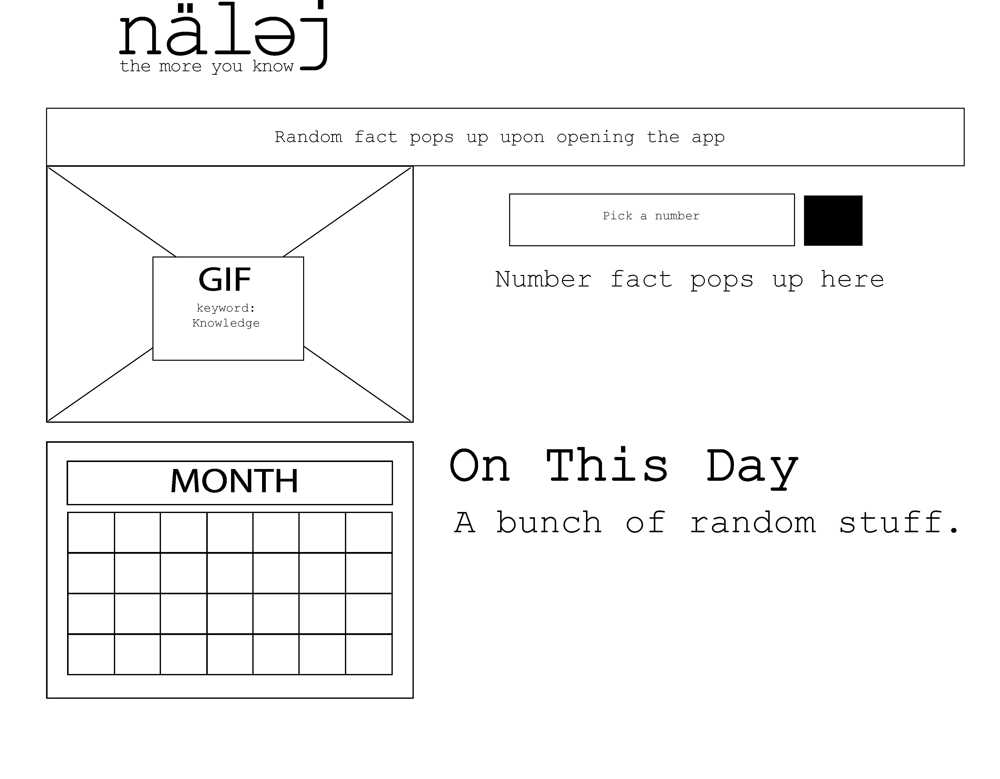

# nälej
The perfect companion for the trivia obsessed, and those who pride themselves in being walking encyclopedias of useless information.

## Table of contents

- [General info](#general-info)
- [User Story](#user-story)
- [Process](#process)
- [Acceptance Criteria](#acceptance-criteria)
- [Demo](#demo)
- [Technologies](#technologies)
- [Status](#status)

## General info.

Upon accessing the application, the user is greeted with a random fact of the day. The user is then able to pull up an event that took place on a specific day by utilizing the provided calendar. Because number rules the world, the user is able to type in a specific numbe and is then presented with an interesting fact centered around that number.

Nalej is information overload at your fingertips.

## User Story

```
GIVEN I am a lover of information and trivia
I WANT an app that can keep me full of useless knowledge without having to think about what to lookup.
WHEN I open my app 
THEN I am presented with a random fact of the day
WHEN I pick a date in the provided calendar 
THEN I am presented with an "On This Day" event and a relevant gif to entertain me.
WHEN I pick a number, because number rules the world,
THEN I am presented with an interesting fact centered around that number.
```
## Process

```





```

## Acceptance Criteria

```
* Use a CSS framework other than Bootstrap.

* Be deployed to GitHub Pages.

* Be interactive (i.e., accept and respond to user input).

* Use at least two server-side APIs.

* Does not use alerts, confirms, or prompts (use modals).

* Use client-side storage to store persistent data.
* Be responsive.

* Have a polished UI.

* Have a clean repository that meets quality coding standards (file structure, naming conventions, follows best practices for class/id naming conventions, indentation, quality comments, etc.).

* Have a quality README (with unique name, description, technologies used, screenshot, and link to deployed application).
```
## Presentation Requirements

Use this [project presentation template](https://docs.google.com/presentation/d/1_u8TKy5zW5UlrVQVnyDEZ0unGI2tjQPDEpA0FNuBKAw/edit?usp=sharing) to address the following: 

* Elevator pitch: a one minute description of your application

* Concept: What is your user story? What was your motivation for development?

* Process: What were the technologies used? How were tasks and roles broken down and assigned? What challenges did you encounter? What were your successes?

* Demo: Show your stuff!

* Directions for Future Development

* Links to the deployed application and the GitHub repository


## Demo


## Technologies
* Foundation
* Javascript
* Giphy API
* Trivia-Knowledge-Facts API
* Numbers API

## Status
Project is: _in progress_
This was a fun app to work on and I hope to expand on it in the near future.

Link to deployed page: https://sdemercurio.github.io/Obliti/

